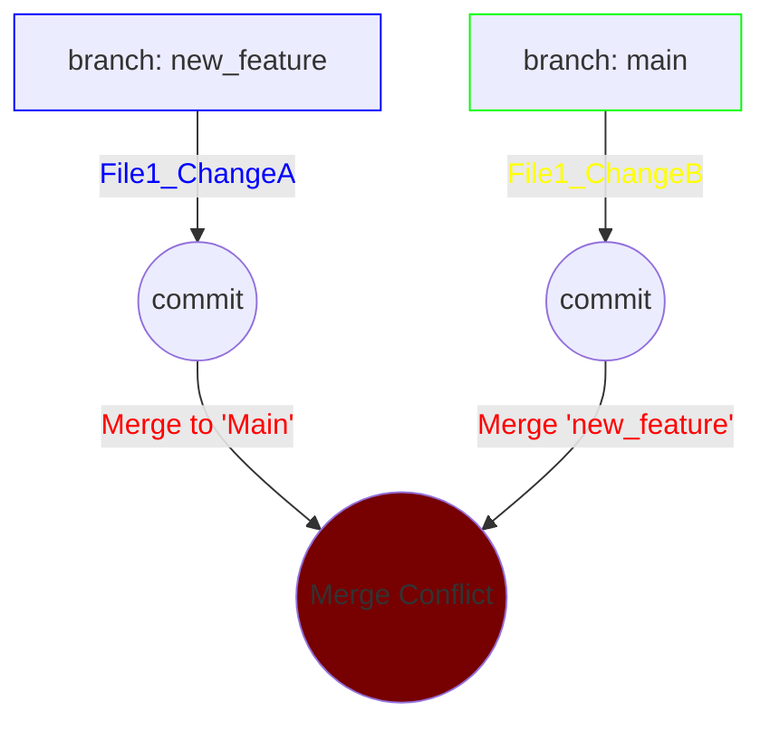
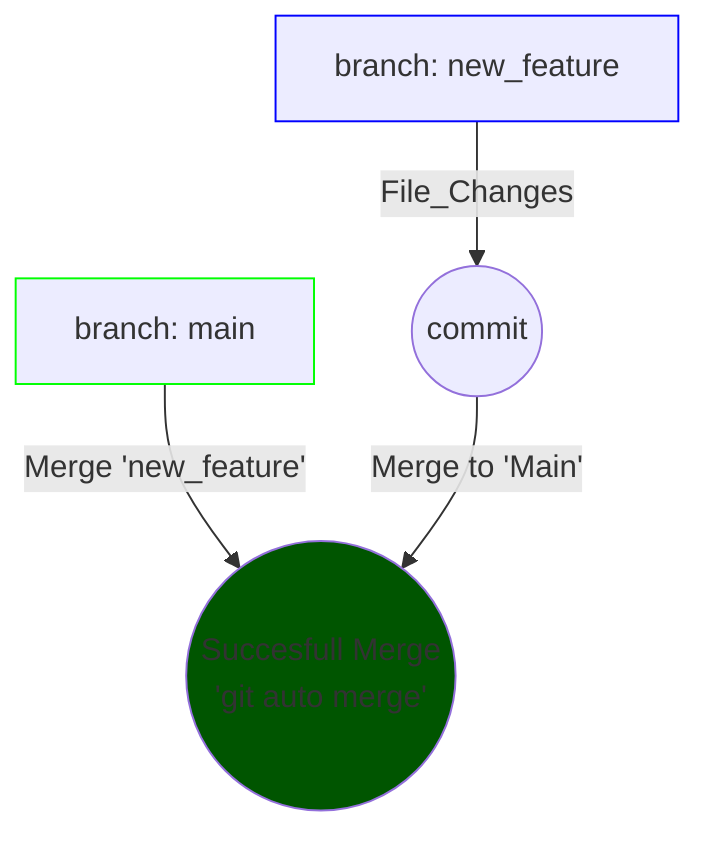

## What are Merge Conflicts in Git?
Merging $\color{red}{conflicting\ changes}$ to the same file from two different branches.
___

### Merge Conflict

```mermaid
graph TD;
    A[branch: new_feature] -- File1_ChangeA --> B((commit))
    B -- Merge to 'Main' --> C((Merge Conflict))
    E[branch: main] -- File1_ChangeB --> G((commit))
    G -- Merge 'new_feature' --> C
    style C fill:#700
    style A stroke:#00f
    style E stroke:#0f0
    linkStyle 1,3 color:red
    linkStyle 0 color:blue
    linkStyle 2 color:yellow
```
___
### Typical Auto Merge

```mermaid
graph TD;
    A[branch: main]
    A -- Merge 'new_feature' --> C((Succesfull Merge 
    'git auto merge'))
    E[branch: new_feature] -- File_Changes --> G((commit))
    G -- Merge to 'Main' --> C
    style C fill:#050
    style A stroke:#0f0
    style E stroke:#00f
```